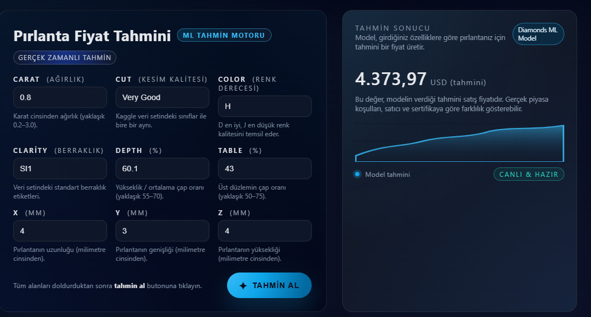

# 💎 Diamond Price Prediction using SVM

This project is a Machine Learning web application that predicts diamond prices based on their physical and quality characteristics.

The model is built using Support Vector Machine (SVM) regression.

<p align="center">
  
</p>


## 📊 Features Used in the Model

- **price** – Price in US dollars ($326–$18,823)
- **carat** – Weight of the diamond (0.2–5.01)
- **cut** – Quality of cut (Fair, Good, Very Good, Premium, Ideal)
- **color** – Diamond color grading (J – worst to D – best)
- **clarity** – Clarity level (I1 – worst to IF – best)
- **x** – Length (mm)
- **y** – Width (mm)
- **z** – Depth (mm)
- **depth** – Total depth percentage
- **table** – Width of top relative to widest point

## 🧠 Model

- Algorithm: Support Vector Machine (SVM)
- Type: Regression
- Data preprocessing: Feature scaling & encoding
- Model saved as: `.pkl` file

## 🌐 Web Interface

Users can input diamond characteristics and get real-time price predictions through a simple web interface.

## 🚀 How to Run

```bash
pip install -r requirements.txt
python app.py
